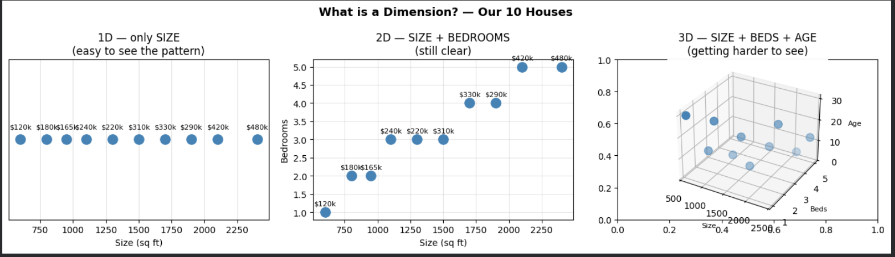
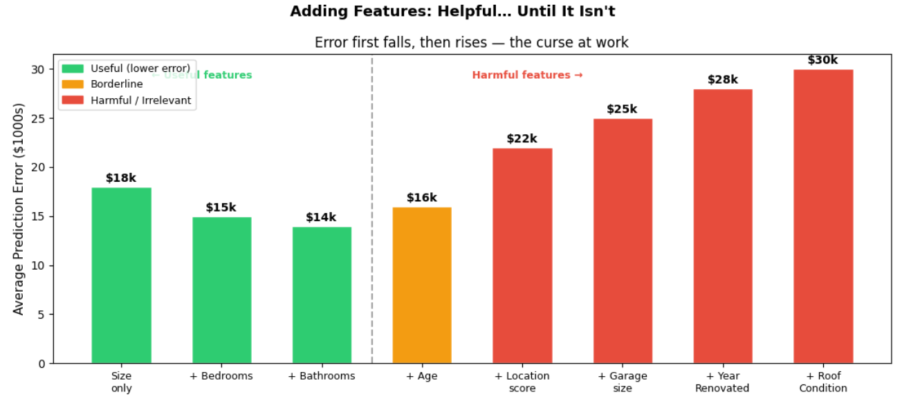
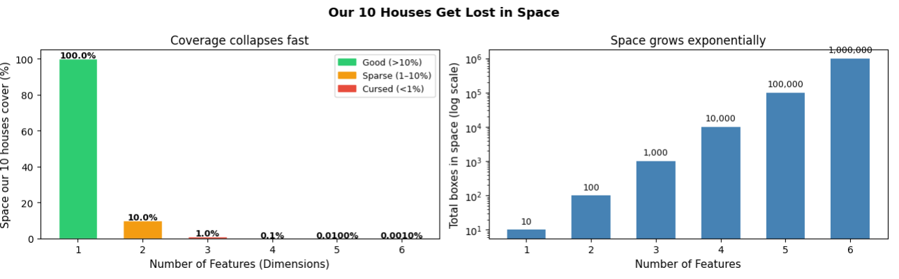
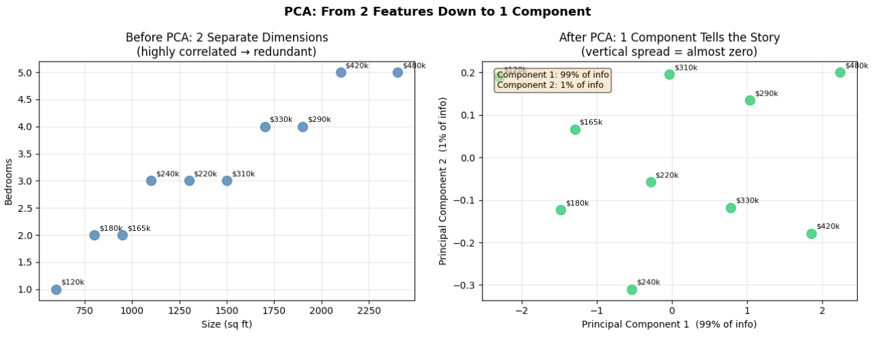

# The Curse of Dimensionality

A beginner-friendly machine learning notebook that explains why adding more features can make models harder to train and less reliable.

This project uses a small house dataset to show:

- what a "dimension" means in machine learning
- how higher-dimensional space becomes sparse
- why too many features can increase prediction error
- how PCA helps reduce dimensionality while keeping most of the useful information

## Notebook

Main notebook: [notebook/curse_of_dimensionality.ipynb](./notebook/curse_of_dimensionality.ipynb)

## Visual Outputs

### 1. Understanding dimensions

This figure shows the same house data in 1D, 2D, and 3D to make the idea of dimensions easy to see.



### 2. The curse of dimensionality

This plot highlights how coverage drops and space grows quickly as dimensions increase.



### 3. Adding more features is not always better

This chart shows the classic pattern where error improves at first, then gets worse as extra features start hurting the model.



### 4. PCA in action

This visualization shows how PCA compresses two correlated features into one stronger component while keeping most of the information.



## What You Learn

- Dimension = one feature or axis in the data
- More dimensions create more empty space
- Sparse high-dimensional space makes learning harder
- Redundant features can hurt performance
- PCA can reduce dimensionality without losing much signal

## Project Structure

```text
curse-of-dimensionality/
|-- notebook/
|   `-- curse_of_dimensionality.ipynb
|-- output/
|   |-- dimensionality_views_1d_2d_3d.png
|   |-- curse_of_dimensionality_space_growth.png
|   |-- adding_features_error_curve.png
|   `-- pca_dimensionality_reduction.png
`-- readme.md
```

## Key Takeaway

More features do not automatically mean a better model. Good models depend on the right features, not just more of them.
